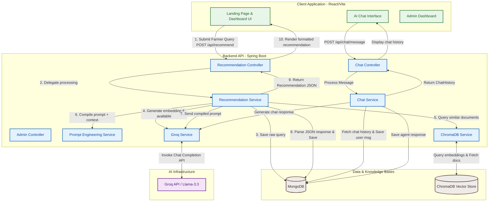

# 🌱 Fertilizer Recommendation Agent

An intelligent, full-stack AI agent that recommends the best fertilizer based on crop type, soil nutrients, weather conditions, and farmer goals. Powered by Spring Boot, React, MongoDB, ChromaDB, and Groq Llama-3.3 API.

🌐 **Live Deployment Link:** [https://ai-fertilizer-agent-4.onrender.com/](https://ai-fertilizer-agent-4.onrender.com/)


## 🚀 Features
- **AI-Powered Recommendations:** Analyzes NPK levels, soil pH, and weather data to provide explainable fertilizer recommendations.
- **RAG Architecture:** Uses ChromaDB as a vector database for retrieving specific agricultural knowledge before prompting Gemini.
- **Modern UI:** Built with React, featuring a responsive, green-gradient glassmorphism dashboard.
- **Containerized:** Ready to deploy via Docker to AWS EC2 or Azure App Service.

## 🛠 Tech Stack
- **Frontend:** React, Vite, Vanilla CSS
- **Backend:** Spring Boot (Java 17), Maven
- **Databases:** MongoDB (Transaction/User data), ChromaDB (Vector Knowledge Base)
- **AI Integration:** Google Gemini API (LLM), Prompt Engineering with Few-Shot examples
- **Infrastructure:** Docker, Docker Compose

## ⚙️ Installation & Setup

1. **Clone the repository**
2. **Setup Environment Variables:**
   Create a `.env` file or export the following variables:
   ```bash
   GEMINI_API_KEY=your_gemini_api_key_here
   OPENWEATHERMAP_API_KEY=your_weather_api_key_here
   ```

3. **Run with Docker Compose (Recommended):**
   This spins up MongoDB and ChromaDB.
   ```bash
   docker-compose up -d
   ```

4. **Start the Backend:**
   ```bash
   cd backend
   mvn spring-boot:run
   ```

5. **Start the Frontend:**
   ```bash
   cd frontend
   npm install
   npm run dev
   ```

## 🏗 Architecture & Flow Diagram

The project uses a classic **Three-Tier Architecture** coupled with a **Retrieval-Augmented Generation (RAG)** pipeline to supply domain-specific agricultural context to the LLM.

For a detailed view of the components and request sequence, please read the [Detailed Flow & Architecture Document](docs/architecture_flow.md).



