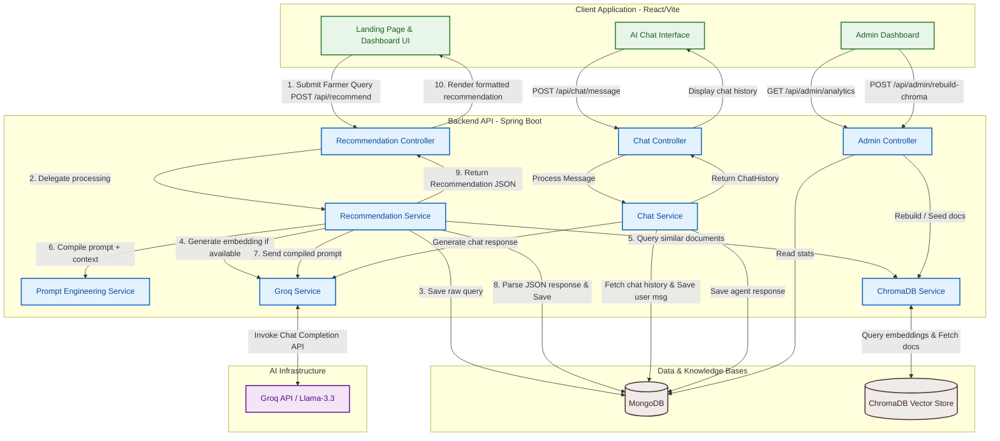
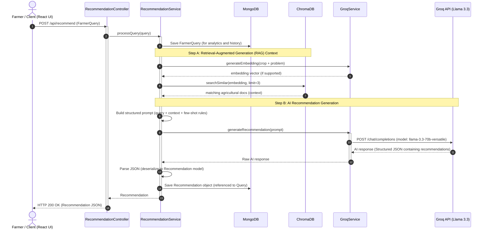

# 🌱 Agriculture Fertilizer Recommendation Agent - Flow & Architecture

This document provides a detailed breakdown of the system architecture, component structures, and data flows within the **Agriculture Fertilizer Recommendation Agent**.

---

## 🏗 System Architecture Diagram

The system follows a classic **Three-Tier Architecture** coupled with a **Retrieval-Augmented Generation (RAG)** pipeline to supply domain-specific agricultural context to the LLM.

---

## 🔄 Sequence Diagram: Fertilizer Recommendation Flow

The diagram below details the chronological sequence of requests, processing steps, database operations, and external API requests executed when a farmer requests a new recommendation.

---

## 🛠 Component Roles & Responsibilities

### 1. Presentation Layer (React + Vite)
- **`LandingPage.jsx`**: Welcomes the user and routes them to the dashboard.
- **`Dashboard.jsx`**: The main interface collecting agricultural telemetry:
  - Crop Details (Name, Stage of growth)
  - Soil Nutrients (NPK, pH, Moisture)
  - Weather & General Info (Location, Weather conditions, Problems observed)
  - Goal Selection (Max Yield, Safe/Minimum Cost, Soil Health improvement)
  - Interactive chatbot helper to address follow-up farming queries.
- **`AdminPanel.jsx`**: Allows administrators to view usage analytics, view user registrations, and trigger ChromaDB vector store rebuilds.

### 2. Controller / Web Layer (Spring Boot RestControllers)
- **`RecommendationController`**: Exposes `/api/recommend` endpoint for posting fertilizer query telemetry.
- **`ChatController`**: Manages conversational message endpoints (`/api/chat/message`) and fetches session chat histories (`/api/chat/history/{sessionId}`).
- **`AdminController`**: Exposes metrics and administrative tools such as rebuilding database search indexes.

### 3. Application Services (Spring Boot Services)
- **`RecommendationService`**: Orchestrates the full pipeline of saving user input, fetching similar documents, prompt composition, model inference, and output formatting.
- **`ChatService`**: Pulls conversational context, posts new dialogue nodes, calls LLM services, and stores dialogue runs.
- **`ChromaDBService`**: Acts as an HTTP gateway to the Vector DB to create collections, upsert document collections, and run cosine similarity search.
- **`GroqService`**: Standardizes payloads sent to Groq endpoints for chat text generation.
- **`PromptEngineeringService`**: Encapsulates few-shot engineering techniques, system instructions, and schemas to ensure the model responds with clean, structured JSON payloads.

---

## 💾 Storage & Data Schemas

The backend interacts with two distinct database instances defined under `docker-compose.yml`:

### MongoDB Collections
1. **`User`**: Stored user accounts/profiles.
2. **`FarmerQuery`**: Structured user queries capturing crop type, NPK, and environmental variables.
3. **`Recommendation`**: Generated outcomes containing application quantities, timings, organic alternatives, and predicted yield improvements.
4. **`ChatHistory`**: Session-bound conversational state mapping the sequence of questions and agent answers.

### ChromaDB Collections
- **`fertilizer_knowledge`**: Document vector index housing agricultural instructions and expert guidelines utilized during the RAG lookup phase.
